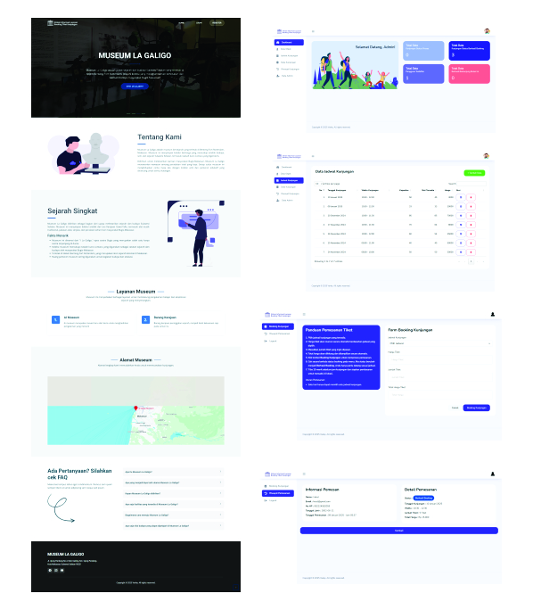

# Sistem Informasi Layanan Booking Tiket Museum

Sistem Informasi Layanan Booking Tiket Museum adalah aplikasi berbasis web yang memungkinkan pengunjung untuk melakukan pemesanan tiket museum secara online. Aplikasi ini mempermudah pengelolaan jadwal kunjungan dan kapasitas museum, serta menyediakan fitur e-ticket otomatis untuk pengguna.

## Fitur Utama
- **Registrasi dan Login Pengguna**: Pengunjung dapat membuat akun untuk melakukan pemesanan tiket.
- **Pemesanan Tiket Online**: Memilih jadwal kunjungan dan memesan tiket secara digital.
- **E-Ticket Otomatis**: Setelah pemesanan berhasil, pengguna akan menerima tiket elektronik.
- **Dashboard Admin**: Mengelola jadwal kunjungan, data pemesanan, laporan kunjungan, dan kapasitas museum secara real-time.

## Teknologi yang Digunakan
- **Frontend**: HTML, CSS, JavaScript
- **Backend**: PHP Native
- **Database**: MySQL

---
**Dibuat oleh Rivanky Valensius Bara**
